# IUP Master V1 - Komplett Datamodell Kartlegging

**Generert**: 22. desember 2025
**Database**: PostgreSQL med Prisma ORM
**Totale modeller**: 62

---

## 📋 Innholdsfortegnelse

1. [Core - Grunnleggende Entities](#core---grunnleggende-entities) (5 modeller)
2. [Auth - Autentisering](#auth---autentisering) (1 modell)
3. [Training - Treningssystem](#training---treningssystem) (4 modeller)
4. [Plans - Treningsplaner](#plans---treningsplaner) (3 modeller)
5. [Events - Arrangementer & Turneringer](#events---arrangementer--turneringer) (5 modeller)
6. [Testing - Test & Vurdering](#testing---test--vurdering) (5 modeller)
7. [Achievements & Badges - Prestasjoner](#achievements--badges---prestasjoner) (3 modeller)
8. [Goals - Målsettinger](#goals---målsettinger) (2 modeller)
9. [Messaging - Kommunikasjon](#messaging---kommunikasjon) (7 modeller)
10. [Notes & Archive - Notater & Arkiv](#notes--archive---notater--arkiv) (2 modeller)
11. [Analytics - Analysedata](#analytics---analysedata) (3 modeller)
12. [Stats - Statistikk](#stats---statistikk) (3 modeller)
13. [Calendar - Kalenderintegrasjon](#calendar---kalenderintegrasjon) (2 modeller)
14. [School - Skole](#school---skole) (3 modeller)
15. [Misc - Diverse](#misc---diverse) (14 modeller)

---

## CORE - Grunnleggende Entities

### 1. Tenant 🏢
Multi-tenant organisasjon (klubb/akademi).

**Primærnøkkel**: `id` (UUID)
**Viktige felter**:
- `name`: String - Organisasjonsnavn
- `slug`: String (unique) - URL-vennlig identifikator
- `subscriptionTier`: Enum (free/basic/pro/enterprise)
- `maxPlayers`: Int - Maks antall spillere
- `maxCoaches`: Int - Maks antall trenere
- `settings`: JSON - Organisasjonsinnstillinger
- `status`: Enum (active/suspended)

**Relasjoner** (13 One-to-Many):
- `coaches → Coach[]`
- `players → Player[]`
- `parents → Parent[]`
- `events → Event[]`
- `tests → Test[]`
- `exercises → Exercise[]`
- `sessionTemplates → SessionTemplate[]`
- `weekPlanTemplates → WeekPlanTemplate[]`
- `media → Media[]`
- `outboxEvents → OutboxEvent[]`
- `users → User[]`
- `clubSpeedCalibrations → ClubSpeedCalibration[]`
- `playerIntakes → PlayerIntake[]`
- `annualTrainingPlans → AnnualTrainingPlan[]`

---

### 2. User 👤
Systembruker (kobles til Coach eller Player via one-to-one).

**Primærnøkkel**: `id` (UUID)
**Viktige felter**:
- `tenantId`: UUID - Org-tilknytning
- `email`: String (unique) - Innlogging
- `passwordHash`: String - Kryptert passord
- `firstName`, `lastName`: String
- `role`: Enum (admin/coach/player/parent)
- `isActive`: Boolean
- `lastLoginAt`: DateTime
- `calendarToken`: String (unique, optional) - For iCal feed

**Relasjoner**:
- Many-to-One: `tenant → Tenant`
- One-to-Many: `refreshTokens → RefreshToken[]`, `notes → Note[]`, `goals → Goal[]`, `archivedItems → ArchivedItem[]`, `achievements → UserAchievement[]`, `seasonBaselines → SeasonBaseline[]`, `requestedModifications → ModificationRequest[]`, `reviewedModifications → ModificationRequest[]`, `fag → Fag[]`, `conversationParticipants → ConversationParticipant[]`, `messages → Message[]`, `calendarIntegrations → CalendarIntegration[]`
- One-to-One: `player → Player?`, `coach → Coach?`

**Indekser**: `[tenantId]`, `[email]`

---

### 3. Coach 🏌️
Trener/coach.

**Primærnøkkel**: `id` (UUID)
**Viktige felter**:
- `tenantId`: UUID
- `userId`: UUID (unique, nullable) - Kobles til User
- `firstName`, `lastName`: String
- `email`: String (unique)
- `phone`: String
- `specializations`: JSON - F.eks. ["putting", "driving"]
- `certifications`: JSON
- `workingHours`: JSON
- `maxPlayersPerSession`: Int
- `hourlyRate`: Decimal (optional)
- `color`: String - Kalenderfarge
- `status`: Enum (active/inactive)

**Relasjoner**:
- Many-to-One: `tenant → Tenant`, `user → User?`
- One-to-Many: `players → Player[]`, `availability → Availability[]`, `trainingSessions → TrainingSession[]`, `savedFilters → SavedFilter[]`, `events → Event[]`

**Indekser**: `[tenantId]`, `[status]`, `[email]`

---

### 4. Parent 👨‍👩‍👧
Forelder/foresatt.

**Primærnøkkel**: `id` (UUID)
**Viktige felter**:
- `tenantId`: UUID
- `firstName`, `lastName`: String
- `email`: String
- `phone`: String
- `preferredContactMethod`: Enum (email/phone/sms)
- `notificationPreferences`: JSON

**Relasjoner**:
- Many-to-One: `tenant → Tenant`
- One-to-Many: `players → Player[]`

**Indekser**: `[tenantId]`

---

### 5. Player ⛳
Golfspiller (hovedentitet).

**Primærnøkkel**: `id` (UUID)
**Viktige felter**:
- `tenantId`: UUID
- `userId`: UUID (unique, nullable) - Kobles til User
- `firstName`, `lastName`: String
- `email`: String
- `dateOfBirth`: DateTime
- `gender`: Enum (M/K)
- `category`: Enum (A-K) - Prestasjonsnivå
- `averageScore`: Decimal
- `handicap`: Decimal
- `wagrRank`: Int - Verdensranking
- `club`: String - Hjemmeklubb
- `coachId`: UUID (nullable) - Primær trener
- `parentId`: UUID (nullable)
- `currentPeriod`: Enum (E/G/S/T) - Periodisering
- `weeklyTrainingHours`: Decimal
- `status`: Enum (active/inactive/on_hold)

**Relasjoner**:
- Many-to-One: `tenant → Tenant`, `user → User?`, `coach → Coach?`, `parent → Parent?`
- One-to-Many: `eventParticipants → EventParticipant[]`, `testResults → TestResult[]`, `tournamentResults → TournamentResult[]`, `trainingSessions → TrainingSession[]`, `breakingPoints → BreakingPoint[]`, `progressLogs → ProgressLog[]`, `benchmarkSessions → BenchmarkSession[]`, `periodizations → Periodization[]`, `notifications → Notification[]`, `intakes → PlayerIntake[]`, `annualPlans → AnnualTrainingPlan[]`, `dailyAssignments → DailyTrainingAssignment[]`, `bookings → Booking[]`, `weeklyStats → WeeklyTrainingStats[]`, `monthlyStats → MonthlyTrainingStats[]`, `dailyStats → DailyTrainingStats[]`, `achievements → PlayerAchievement[]`, `badges → PlayerBadge[]`, `playerGoals → PlayerGoal[]`
- One-to-One: `clubSpeedCalibration → ClubSpeedCalibration?`

**Indekser**: `[tenantId]`, `[category]`, `[status]`, `[coachId]`

---

## AUTH - Autentisering

### 6. RefreshToken 🔐
JWT refresh tokens for autentisering.

**Primærnøkkel**: `id` (UUID)
**Viktige felter**:
- `userId`: UUID
- `token`: String (unique) - Refresh token
- `expiresAt`: DateTime
- `isRevoked`: Boolean (default: false)

**Relasjoner**:
- Many-to-One: `user → User`

**Indekser**: `[userId]`, `[token]`

---

## TRAINING - Treningssystem

### 7. TrainingSession 🎯
Gjennomført treningsøkt.

**Primærnøkkel**: `id` (UUID)
**Viktige felter**:
- `playerId`: UUID
- `coachId`: UUID (nullable)
- `sessionType`: Enum (technical/physical/play/competition)
- `sessionDate`: DateTime
- `duration`: Int (minutter)
- `learningPhase`: Enum (L1-L5) - Motorisk læringsfase
- `clubSpeed`: Int (1-5) - Hastighet på svinger
- `setting`: Enum (range/sim/course/gym)
- `focusArea`: String
- `period`: Enum (E/G/S/T)
- `intensity`: Int (1-5)
- `evaluationFocus`: Int (1-10)
- `evaluationTechnical`: Int (1-10)
- `evaluationEnergy`: Int (1-10)
- `evaluationMental`: Int (1-10)
- `preShotConsistency`: Int (1-10)
- `completionStatus`: Enum (in_progress/completed/skipped/cancelled)
- `completedAt`: DateTime (nullable)

**Relasjoner**:
- Many-to-One: `player → Player`, `coach → Coach?`
- One-to-Many: `assignedFrom → DailyTrainingAssignment[]`

**Indekser**: `[playerId]`, `[coachId]`, `[sessionDate]`, `[dailyAssignmentId]`

---

### 8. SessionTemplate 📋
Mal for treningsøkter.

**Primærnøkkel**: `id` (UUID)
**Viktige felter**:
- `tenantId`: UUID
- `name`: String - "L3 Technical - Putting"
- `sessionType`: Enum
- `learningPhase`: Enum (L1-L5)
- `setting`: Enum
- `clubSpeed`: Int (1-5)
- `categories`: String[] - Hvilke kategorier (A-K)
- `periods`: String[] - Hvilke perioder (E/G/S/T)
- `duration`: Int (minutter)
- `exerciseSequence`: JSON - Øvelsesrekkefølge
- `usageCount`: Int
- `isActive`: Boolean

**Relasjoner**:
- Many-to-One: `tenant → Tenant`
- One-to-Many: `dailyAssignments → DailyTrainingAssignment[]`

**Indekser**: `[tenantId]`, `[sessionType]`

---

### 9. WeekPlanTemplate 📅
Ukentlige treningsmaler.

**Primærnøkkel**: `id` (UUID)
**Viktige felter**:
- `tenantId`: UUID
- `name`: String - "Kategori A - Sesong"
- `category`: Enum (A-K)
- `period`: Enum (E/G/S/T)
- `variant`: String - "Standard" / "Light" / "Heavy"
- `mondaySessions` til `sundaySessions`: String[] (UUID av SessionTemplate)
- `distribution`: JSON - Fordeling av økter
- `restDay`: Int (0-6) - Hvilken dag er hviledag
- `usageCount`: Int
- `isActive`: Boolean

**Relasjoner**:
- Many-to-One: `tenant → Tenant`

**Unique constraints**: `[tenantId, category, period, variant]`
**Indekser**: `[tenantId]`

---

### 10. Exercise 💪
Øvelsesbibliotek.

**Primærnøkkel**: `id` (UUID)
**Viktige felter**:
- `tenantId`: UUID
- `name`: String - "Gate Drill"
- `description`: Text
- `exerciseType`: Enum (technical/physical/mental/play)
- `learningPhases`: String[] - Hvilke L-faser (L1-L5)
- `settings`: String[] - range/sim/course/gym
- `clubSpeedLevels`: Int[] - 1-5
- `categories`: String[] - A-K
- `periods`: String[] - E/G/S/T
- `equipment`: String[] - Utstyr som trengs
- `difficulty`: Int (1-5)
- `progressionSteps`: JSON - Hvordan gjøre vanskeligere
- `regressionSteps`: JSON - Hvordan gjøre enklere
- `successCriteria`: JSON - Hva er suksess
- `coachingCues`: String[] - Instruksjonspunkter
- `processCategory`: Enum (rhythm/clubface/swing_path/...)
- `videoUrl`: String
- `imageUrl`: String
- `usageCount`: Int
- `isActive`: Boolean

**Relasjoner**:
- Many-to-One: `tenant → Tenant`

**Indekser**: `[tenantId]`, `[exerciseType]`, `[isActive]`

---

## PLANS - Treningsplaner

### 11. AnnualTrainingPlan 🗓️
12-måneders treningsplan.

**Primærnøkkel**: `id` (UUID)
**Viktige felter**:
- `playerId`: UUID (unique) - Én plan per spiller
- `tenantId`: UUID
- `planName`: String
- `startDate`, `endDate`: DateTime
- `status`: Enum (active/completed/paused/cancelled)
- `baselineAverageScore`: Decimal
- `baselineHandicap`: Decimal
- `baselineDriverSpeed`: Decimal
- `playerCategory`: Enum (A-K)
- `basePeriodWeeks`: Int - Uker i base-periode
- `specializationWeeks`: Int - Uker i spesialisering
- `tournamentWeeks`: Int - Uker med turneringer
- `weeklyHoursTarget`: Decimal
- `intensityProfile`: JSON - Intensitetsprofil
- `generatedAt`: DateTime

**Relasjoner**:
- Many-to-One: `player → Player`, `tenant → Tenant`
- One-to-Many: `dailyAssignments → DailyTrainingAssignment[]`, `scheduledTournaments → ScheduledTournament[]`, `periodizations → Periodization[]`, `modificationRequests → ModificationRequest[]`

**Indekser**: `[playerId]`, `[tenantId]`, `[status]`, `[startDate]`

---

### 12. DailyTrainingAssignment 📍
Daglig tildelt treningsøkt.

**Primærnøkkel**: `id` (UUID)
**Viktige felter**:
- `annualPlanId`: UUID
- `playerId`: UUID
- `assignedDate`: Date - Dato for økten
- `weekNumber`: Int (1-52)
- `dayOfWeek`: Int (0-6)
- `sessionTemplateId`: UUID (nullable)
- `sessionType`: Enum
- `estimatedDuration`: Int (minutter)
- `period`: Enum (E/G/S/T)
- `learningPhase`: Enum (L1-L5)
- `clubSpeed`: Int (1-5)
- `intensity`: Int (1-5)
- `isRestDay`: Boolean
- `isOptional`: Boolean
- `canBeSubstituted`: Boolean
- `status`: Enum (planned/completed/skipped/rescheduled)
- `completedSessionId`: UUID (nullable) - Kobles til TrainingSession
- `completedAt`: DateTime (nullable)

**Relasjoner**:
- Many-to-One: `annualPlan → AnnualTrainingPlan`, `player → Player`, `sessionTemplate → SessionTemplate?`, `completedSession → TrainingSession?`

**Unique constraints**: `[annualPlanId, assignedDate, sessionType]` (maks én økt per type per dag)
**Indekser**: `[annualPlanId]`, `[playerId]`, `[assignedDate]`, `[weekNumber]`, `[status]`

---

### 13. ModificationRequest 📋
Forespørsel om endring av treningsplan.

**Primærnøkkel**: `id` (UUID)
**Viktige felter**:
- `annualPlanId`: UUID
- `requestedBy`: UUID - User ID
- `concerns`: String - Årsak/bekymringer
- `notes`: Text
- `urgency`: Enum (low/medium/high)
- `status`: Enum (pending/under_review/resolved/rejected)
- `coachResponse`: Text (nullable)
- `reviewedBy`: UUID (nullable) - Coach/Admin User ID
- `reviewedAt`: DateTime (nullable)

**Relasjoner**:
- Many-to-One: `annualPlan → AnnualTrainingPlan`, `requester → User`, `reviewer → User?`

**Indekser**: `[annualPlanId]`, `[requestedBy]`, `[status]`, `[createdAt]`

---

## EVENTS - Arrangementer & Turneringer

### 14. Event 📌
Generell event (treningssamling, turnering, osv).

**Primærnøkkel**: `id` (UUID)
**Viktige felter**:
- `tenantId`: UUID
- `title`: String
- `description`: Text
- `eventType`: Enum (training_session/group_lesson/tournament/camp/meeting)
- `startTime`, `endTime`: DateTime
- `allDay`: Boolean
- `timezone`: String
- `location`: String
- `coachId`: UUID (nullable)
- `maxParticipants`: Int (nullable)
- `currentCount`: Int (default: 0)
- `status`: Enum (scheduled/in_progress/completed/cancelled)
- `recurrenceRule`: JSON (nullable) - For recurring events
- `parentEventId`: UUID (nullable) - Hvis del av recurring series
- `metadata`: JSON

**Relasjoner**:
- Many-to-One: `tenant → Tenant`, `coach → Coach?`
- One-to-Many: `participants → EventParticipant[]`, `bookings → Booking[]`
- One-to-One: `tournament → Tournament?`

**Indekser**: `[tenantId]`, `[eventType]`, `[startTime]`, `[coachId]`

---

### 15. EventParticipant ✅
Deltakere i event.

**Primærnøkkel**: `id` (UUID)
**Viktige felter**:
- `eventId`: UUID
- `playerId`: UUID
- `status`: Enum (registered/confirmed/checked_in/checked_out/cancelled/no_show)
- `checkedInAt`, `checkedOutAt`: DateTime (nullable)
- `performance`: JSON (nullable) - Prestasjonsdata
- `paymentStatus`: Enum (unpaid/paid/refunded)

**Relasjoner**:
- Many-to-One: `event → Event`, `player → Player`

**Indekser**: `[eventId]`, `[playerId]`

---

### 16. Tournament 🏆
Turnering (extends Event).

**Primærnøkkel**: `id` (UUID)
**Viktige felter**:
- `eventId`: UUID (unique) - One-to-one med Event
- `tournamentType`: Enum (strokeplay/matchplay/scramble/best_ball)
- `level`: Enum (club/regional/national/international/professional)
- `courseName`: String
- `par`: Int
- `courseRating`: Decimal
- `slopeRating`: Int
- `format`: String - "72 holes"
- `numberOfRounds`: Int
- `entryFee`: Decimal (nullable)
- `prizePool`: Decimal (nullable)
- `toppingWeeks`: Int (nullable) - Uker før topping
- `taperingDays`: Int (nullable) - Dager før tapering
- `focusAreas`: JSON - Spesifikke fokusområder

**Relasjoner**:
- One-to-One: `event → Event`
- One-to-Many: `results → TournamentResult[]`, `scheduledIn → ScheduledTournament[]`

---

### 17. TournamentResult 🎖️
Turneringsresultat.

**Primærnøkkel**: `id` (UUID)
**Viktige felter**:
- `tournamentId`: UUID
- `playerId`: UUID
- `position`: Int - Plassering
- `totalScore`: Int - Total score
- `scoreToPar`: Int - Relatert til par
- `roundScores`: JSON - Score per runde
- `strokesGained`: JSON - Strokes gained stats
- `fairwaysHit`: Decimal (%)
- `greensInRegulation`: Decimal (%)
- `puttsPerRound`: Decimal

**Relasjoner**:
- Many-to-One: `tournament → Tournament`, `player → Player`
- One-to-One: `scheduledTournament → ScheduledTournament?`

**Indekser**: `[tournamentId]`, `[playerId]`

---

### 18. Booking 📅
Booking av event/tilgjengelighet.

**Primærnøkkel**: `id` (UUID)
**Viktige felter**:
- `eventId`: UUID
- `playerId`: UUID
- `availabilityId`: UUID (nullable)
- `bookedBy`: UUID - User ID
- `bookingType`: Enum (player_request/coach_assigned/auto_generated)
- `status`: Enum (pending/confirmed/in_progress/completed/cancelled/no_show)
- `bookedAt`: DateTime
- `confirmedAt`, `cancelledAt`: DateTime (nullable)
- `cancellationReason`: String (nullable)
- `paymentStatus`: Enum (unpaid/paid/refunded)
- `paymentAmount`: Decimal (nullable)
- `reminderSent`: Boolean

**Relasjoner**:
- Many-to-One: `event → Event`, `player → Player`, `availability → Availability?`

**Indekser**: `[eventId]`, `[playerId]`, `[status]`, `[bookedAt]`

---

## TESTING - Test & Vurdering

### 19. Test 🧪
Test-definisjon (1-20 kategorikrav-tester).

**Primærnøkkel**: `id` (UUID)
**Viktige felter**:
- `tenantId`: UUID
- `name`: String - "Test 1: Driver Distance"
- `testNumber`: Int (1-20)
- `category`: Enum (A-K)
- `testType`: Enum (physical/technical/mental/playing)
- `protocolName`: String - "AK Golf Test Protocol"
- `protocolVersion`: String - "v1.0"
- `description`: Text
- `targetCategory`: Enum (A-K) - Hvilken kategori tester dette
- `testDetails`: JSON - Detaljert testbeskrivelse
- `benchmarkWeek`: Int (1-52) - Når skal det kjøres
- `isActive`: Boolean

**Relasjoner**:
- Many-to-One: `tenant → Tenant`
- One-to-Many: `results → TestResult[]`

**Unique constraints**: `[tenantId, testNumber]`
**Indekser**: `[tenantId]`, `[testType]`

---

### 20. TestResult 📊
Testresultat fra gjennomført test.

**Primærnøkkel**: `id` (UUID)
**Viktige felter**:
- `testId`: UUID
- `playerId`: UUID
- `testDate`: DateTime
- `testTime`: String (HH:MM)
- `location`: String
- `facility`: String
- `environment`: Enum (indoor/outdoor)
- `weather`: String (nullable)
- `results`: JSON - Detaljerte resultater
- `value`: Decimal - Hovedverdi
- `pei`: Decimal (nullable) - Physical Efficiency Index (for Test 4)
- `passed`: Boolean - Om kravet ble bestått
- `categoryRequirement`: Decimal - Kravet for denne kategorien
- `percentOfRequirement`: Decimal - Prosent av kravet
- `improvementFromLast`: Decimal (nullable) - Forbedring fra forrige
- `videoUrl`: String (nullable)
- `trackerData`: JSON (nullable) - Data fra tracker
- `coachFeedback`: Text (nullable)
- `playerFeedback`: Text (nullable)

**Relasjoner**:
- Many-to-One: `test → Test`, `player → Player`
- One-to-Many: `peerComparisons → PeerComparison[]`

**Indekser**: `[testId]`, `[playerId]`, `[testDate]`, `[passed]`

---

### 21. CategoryRequirement 📏
Krav per kategori (A-K) per test.

**Primærnøkkel**: `id` (UUID)
**Viktige felter**:
- `category`: Enum (A-K)
- `gender`: Enum (M/K)
- `testNumber`: Int (1-20)
- `requirement`: Decimal - Kravet
- `unit`: String - "m", "km/t", "°", etc.
- `comparison`: Enum (>=, <=, range)
- `rangeMin`, `rangeMax`: Decimal (nullable) - For range-krav
- `isActive`: Boolean

**Unique constraints**: `[category, gender, testNumber]`
**Indekser**: `[category]`, `[testNumber]`

---

### 22. PeerComparison 👥
Sammenligning med peers.

**Primærnøkkel**: `id` (UUID)
**Viktige felter**:
- `testResultId`: UUID
- `playerId`: UUID
- `testNumber`: Int
- `peerCount`: Int - Antall peers i sammenligningen
- `peerMean`: Decimal - Gjennomsnitt
- `peerMedian`: Decimal - Median
- `peerStdDev`: Decimal - Standardavvik
- `peerMin`, `peerMax`: Decimal
- `percentile25`, `percentile75`, `percentile90`: Decimal
- `playerValue`: Decimal - Spillerens verdi
- `playerPercentile`: Decimal - Hvilken persentil (0-100)
- `playerRank`: Int - Plassering (1, 2, 3...)
- `playerZScore`: Decimal - Z-score
- `peerCriteria`: JSON - Kriterier for peer-gruppen
- `comparisonText`: String - "Du er bedre enn 75% av..."
- `calculatedAt`: DateTime

**Relasjoner**:
- Many-to-One: `testResult → TestResult`

**Indekser**: `[playerId, testNumber]`, `[calculatedAt]`

---

### 23. ClubSpeedCalibration ⚙️
Klubbhastighet kalibrering.

**Primærnøkkel**: `id` (UUID)
**Viktige felter**:
- `playerId`: UUID (unique) - Én kalibrering per spiller
- `tenantId`: UUID
- `calibrationDate`: DateTime
- `driverSpeed`: Decimal - km/t
- `clubsData`: JSON - Alle klubber (driver, 3w, 5w, 7i, PW)
- `speedProfile`: JSON - Profil for hastigheter
- `notes`: Text (nullable)

**Relasjoner**:
- One-to-One: `player → Player`
- Many-to-One: `tenant → Tenant`
- One-to-Many: `breakingPoints → BreakingPoint[]`

**Indekser**: `[playerId]`, `[tenantId]`

---

## ACHIEVEMENTS & BADGES - Prestasjoner

### 24. AchievementDefinition 🏅
Definisjon av achievements.

**Primærnøkkel**: `id` (UUID)
**Viktige felter**:
- `code`: String (unique) - "first_training", "week_streak_7"
- `name`: String - "Første trening"
- `description`: Text - "Fullført din første økt"
- `category`: Enum (streak/milestone/skill/special)
- `icon`: String - Icon identifier
- `tier`: Enum (bronze/silver/gold/platinum)
- `requirements`: JSON - Hva skal til for å få
- `pointsValue`: Int - Poeng verdien
- `sortOrder`: Int
- `isActive`: Boolean

**Relasjoner**:
- One-to-Many: `playerAchievements → PlayerAchievement[]`

**Indekser**: `[category]`, `[isActive]`

---

### 25. PlayerAchievement ⭐
Spillerens oppnådde achievements.

**Primærnøkkel**: `id` (UUID)
**Viktige felter**:
- `playerId`: UUID
- `achievementId`: UUID
- `earnedAt`: DateTime
- `context`: JSON - Kontekst (f.eks. "7-day streak")
- `notified`: Boolean - Om spilleren har fått varsel
- `notifiedAt`: DateTime (nullable)

**Relasjoner**:
- Many-to-One: `player → Player`, `achievement → AchievementDefinition`

**Unique constraints**: `[playerId, achievementId]` (kun én gang per achievement)
**Indekser**: `[playerId]`, `[earnedAt]`

---

### 26. PlayerBadge 🎖️
Spillerens badges (85 hierarkiske badges).

**Primærnøkkel**: `id` (UUID)
**Viktige felter**:
- `playerId`: UUID
- `badgeId`: String - "category_a_promoted", "test_4_bronze"
- `progress`: Decimal - Framgang (0-100)
- `targetValue`: Decimal (nullable) - Målverdi
- `earnedAt`: DateTime (nullable) - Når ble det oppnådd
- `viewedAt`: DateTime (nullable) - Når spilleren så det

**Relasjoner**:
- Many-to-One: `player → Player`

**Unique constraints**: `[playerId, badgeId]`
**Indekser**: `[playerId]`, `[earnedAt]`

---

## GOALS - Målsettinger

### 27. Goal 🎯
Generelle mål (user-nivå).

**Primærnøkkel**: `id` (UUID)
**Viktige felter**:
- `userId`: UUID
- `title`: String - "Senke handicap til 5"
- `description`: Text
- `goalType`: Enum (score/technique/physical/mental/competition)
- `timeframe`: Enum (short/medium/long) - kort/medium/lang
- `targetValue`: Decimal
- `currentValue`: Decimal
- `startValue`: Decimal
- `unit`: String - "handicap", "m", "poeng"
- `progressPercent`: Decimal (0-100)
- `startDate`: DateTime
- `targetDate`: DateTime
- `completedDate`: DateTime (nullable)
- `status`: Enum (active/completed/paused/cancelled)
- `icon`: String
- `color`: String
- `milestones`: JSON - Delmål

**Relasjoner**:
- Many-to-One: `user → User`

**Indekser**: `[userId]`, `[status]`, `[targetDate]`, `[goalType]`

---

### 28. PlayerGoal 🎯
Player-spesifikke mål.

**Primærnøkkel**: `id` (UUID)
**Viktige felter**:
- `playerId`: UUID
- `title`, `description`: String
- `goalType`: Enum
- `timeframe`: Enum
- `targetValue`, `currentValue`, `startValue`: Decimal
- `unit`: String
- `progressPercent`: Decimal
- `startDate`, `targetDate`, `completedDate`: DateTime
- `status`: Enum
- `icon`, `color`: String
- `linkedTestId`: UUID (nullable) - Kobles til Test
- `linkedBreakingPointId`: UUID (nullable) - Kobles til BreakingPoint
- `progressHistory`: JSON - Historie over framgang
- `coachNotes`: Text (nullable)
- `playerNotes`: Text (nullable)

**Relasjoner**:
- Many-to-One: `player → Player`

**Indekser**: `[playerId]`, `[status]`, `[targetDate]`

---

## MESSAGING - Kommunikasjon

### 29. Conversation 💬
Konversasjon (1-1 eller gruppe).

**Primærnøkkel**: `id` (UUID)
**Viktige felter**:
- `type`: Enum (direct/group/coach_player)
- `name`: String (nullable) - Navn på gruppe

**Relasjoner**:
- One-to-Many: `participants → ConversationParticipant[]`, `messages → Message[]`

**Indekser**: `[type]`, `[updatedAt]`

---

### 30. ConversationParticipant 👤
Deltaker i konversasjon.

**Primærnøkkel**: `id` (UUID)
**Viktige felter**:
- `conversationId`: UUID
- `userId`: UUID
- `isMuted`: Boolean
- `lastReadAt`: DateTime (nullable)
- `joinedAt`: DateTime
- `leftAt`: DateTime (nullable)

**Relasjoner**:
- Many-to-One: `conversation → Conversation`, `user → User`

**Unique constraints**: `[conversationId, userId]`
**Indekser**: `[conversationId]`, `[userId]`

---

### 31. Message ✉️
Melding i konversasjon.

**Primærnøkkel**: `id` (UUID)
**Viktige felter**:
- `conversationId`: UUID
- `senderId`: UUID
- `content`: Text
- `attachments`: JSON (nullable) - Vedlegg
- `editedAt`: DateTime (nullable)
- `deletedAt`: DateTime (nullable)

**Relasjoner**:
- Many-to-One: `conversation → Conversation`, `sender → User`
- One-to-Many: `readBy → MessageRead[]`

**Indekser**: `[conversationId]`, `[senderId]`, `[createdAt]`

---

### 32. MessageRead 👁️
Lest-status for meldinger.

**Primærnøkkel**: `id` (UUID)
**Viktige felter**:
- `messageId`: UUID
- `userId`: UUID
- `readAt`: DateTime

**Relasjoner**:
- Many-to-One: `message → Message`

**Unique constraints**: `[messageId, userId]`
**Indekser**: `[messageId]`, `[userId]`

---

### 33. ChatGroup 👥
Chat-gruppe (alternativt messaging-system).

**Primærnøkkel**: `id` (UUID)
**Viktige felter**:
- `tenantId`: UUID
- `name`: String
- `description`: Text (nullable)
- `groupType`: Enum (direct/team/academy/coach_player)
- `avatarUrl`: String (nullable)
- `avatarInitials`: String (2 chars)
- `avatarColor`: String
- `isArchived`: Boolean
- `isMuted`: Boolean
- `createdBy`: UUID
- `lastMessageAt`: DateTime (nullable)

**Relasjoner**:
- One-to-Many: `members → ChatGroupMember[]`, `messages → ChatMessage[]`

**Indekser**: `[tenantId]`, `[groupType]`, `[lastMessageAt]`

---

### 34. ChatGroupMember 👤
Medlem av chat-gruppe.

**Primærnøkkel**: `id` (UUID)
**Viktige felter**:
- `groupId`: UUID
- `memberType`: Enum (player/coach/parent)
- `memberId`: UUID - ID av player/coach/parent
- `role`: Enum (admin/member)
- `lastReadAt`: DateTime (nullable)
- `lastReadMessageId`: UUID (nullable)
- `unreadCount`: Int (default: 0)
- `isMuted`: Boolean
- `notificationsEnabled`: Boolean
- `joinedAt`: DateTime
- `leftAt`: DateTime (nullable)

**Relasjoner**:
- Many-to-One: `group → ChatGroup`

**Unique constraints**: `[groupId, memberType, memberId]`
**Indekser**: `[groupId]`, `[memberId]`, `[unreadCount]`

---

### 35. ChatMessage 💬
Melding i chat-gruppe.

**Primærnøkkel**: `id` (UUID)
**Viktige felter**:
- `groupId`: UUID
- `senderType`: Enum (player/coach/parent/system)
- `senderId`: UUID (nullable) - ID av avsender
- `messageType`: Enum (text/image/video/file/system)
- `content`: Text
- `metadata`: JSON (nullable) - For vedlegg, etc.
- `replyToId`: UUID (nullable) - For svar på meldinger
- `isEdited`: Boolean
- `editedAt`: DateTime (nullable)
- `isDeleted`: Boolean
- `deletedAt`: DateTime (nullable)

**Relasjoner**:
- Many-to-One: `group → ChatGroup`, `replyTo → ChatMessage?` (self-referencing)
- One-to-Many: `replies → ChatMessage[]`

**Indekser**: `[groupId]`, `[senderId]`, `[createdAt]`

---

## NOTES & ARCHIVE - Notater & Arkiv

### 36. Note 📝
Brukernotater.

**Primærnøkkel**: `id` (UUID)
**Viktige felter**:
- `userId`: UUID
- `title`: String
- `content`: Text
- `category`: String (nullable) - "Treningsnotat", "Konkurranse"
- `tags`: String[] - Tags
- `isPinned`: Boolean
- `color`: String (nullable)
- `linkedEntityType`: String (nullable) - "TrainingSession", "Tournament"
- `linkedEntityId`: UUID (nullable)

**Relasjoner**:
- Many-to-One: `user → User`

**Indekser**: `[userId]`, `[category]`, `[isPinned]`, `[createdAt]`

---

### 37. ArchivedItem 📦
Arkiverte elementer.

**Primærnøkkel**: `id` (UUID)
**Viktige felter**:
- `userId`: UUID - Hvem arkiverte
- `entityType`: String - "TrainingSession", "Goal"
- `entityId`: UUID - ID av arkivert element
- `entityData`: JSON - Snapshot av data
- `archivedAt`: DateTime
- `reason`: String (nullable) - Hvorfor arkivert

**Relasjoner**:
- Many-to-One: `user → User`

**Unique constraints**: `[entityType, entityId]`
**Indekser**: `[userId]`, `[entityType]`, `[archivedAt]`

---

## ANALYTICS - Analysedata

### 38. DataGolfPlayer ⛳
Data fra DataGolf API.

**Primærnøkkel**: `id` (UUID)
**Viktige felter**:
- `dataGolfId`: Int (unique) - DataGolf player ID
- `playerName`: String
- `sgTotal`: Decimal (nullable) - Strokes gained total
- `sgOffTee`: Decimal (nullable) - Strokes gained off the tee
- `sgApproach`: Decimal (nullable) - Strokes gained approach
- `sgAroundGreen`: Decimal (nullable) - Strokes gained around the green
- `sgPutting`: Decimal (nullable) - Strokes gained putting
- `drivingDistance`: Decimal (nullable) - Yards
- `drivingAccuracy`: Decimal (nullable) - %
- `girPercent`: Decimal (nullable) - Greens in regulation %
- `scramblingPercent`: Decimal (nullable) - %
- `puttsPerRound`: Decimal (nullable)
- `proximityData`: JSON (nullable) - Proximity stats
- `tour`: Enum (pga/european/korn_ferry/lpga)
- `season`: Int - Year
- `iupPlayerId`: UUID (unique, nullable) - Kobles til Player
- `lastSynced`: DateTime

**Indekser**: `[dataGolfId]`, `[tour, season]`

---

### 39. DataGolfTourAverage 📊
Tour-gjennomsnitt fra DataGolf.

**Primærnøkkel**: `id` (UUID)
**Viktige felter**:
- `tour`: Enum (pga/european/korn_ferry)
- `season`: Int - Year
- `stats`: JSON - Alle gjennomsnittsstats

**Unique constraints**: `[tour, season]`
**Indekser**: `[tour]`

---

### 40. AnalyticsCache 💾
Cache for analytics-beregninger.

**Primærnøkkel**: `id` (UUID)
**Viktige felter**:
- `cacheKey`: String (unique) - "player_123_weekly_stats_2025_12"
- `cacheType`: String - "weekly_stats", "peer_comparison"
- `data`: JSON - Cachet data
- `calculatedAt`: DateTime
- `expiresAt`: DateTime
- `metadata`: JSON (nullable)

**Indekser**: `[cacheKey]`, `[expiresAt]`, `[cacheType]`

---

## STATS - Statistikk

### 41. WeeklyTrainingStats 📊
Ukentlig treningsstatistikk.

**Primærnøkkel**: `id` (UUID)
**Viktige felter**:
- `playerId`: UUID
- `year`: Int
- `weekNumber`: Int (1-52)
- `weekStartDate`, `weekEndDate`: DateTime
- `plannedSessions`: Int
- `completedSessions`: Int
- `skippedSessions`: Int
- `completionRate`: Decimal (%)
- `plannedMinutes`: Int
- `actualMinutes`: Int
- `sessionTypeBreakdown`: JSON - Fordeling per type
- `learningPhaseMinutes`: JSON - Minutter per L-fase
- `avgQuality`: Decimal (1-10)
- `avgFocus`: Decimal (1-10)
- `avgIntensity`: Decimal (1-5)
- `currentStreak`: Int - Nåværende streak
- `longestStreakInWeek`: Int
- `period`: Enum (E/G/S/T)

**Relasjoner**:
- Many-to-One: `player → Player`

**Unique constraints**: `[playerId, year, weekNumber]`
**Indekser**: `[playerId]`, `[year, weekNumber]`, `[weekStartDate]`

---

### 42. MonthlyTrainingStats 📊
Månedlig treningsstatistikk.

**Primærnøkkel**: `id` (UUID)
**Viktige felter**:
- `playerId`: UUID
- `year`: Int
- `month`: Int (1-12)
- `totalSessions`: Int
- `completedSessions`: Int
- `completionRate`: Decimal (%)
- `totalMinutes`: Int
- `avgMinutesPerSession`: Decimal
- `avgMinutesPerDay`: Decimal
- `sessionTypeBreakdown`: JSON
- `avgQuality`: Decimal (1-10)
- `avgFocus`: Decimal (1-10)
- `testsCompleted`: Int
- `testsPassed`: Int
- `badgesEarned`: Int

**Relasjoner**:
- Many-to-One: `player → Player`

**Unique constraints**: `[playerId, year, month]`
**Indekser**: `[playerId]`, `[year, month]`

---

### 43. DailyTrainingStats 📊
Daglig treningsstatistikk.

**Primærnøkkel**: `id` (UUID)
**Viktige felter**:
- `playerId`: UUID
- `date`: Date
- `plannedSessions`: Int
- `completedSessions`: Int
- `plannedMinutes`: Int
- `actualMinutes`: Int
- `sessions`: JSON - Array av session info
- `avgQuality`: Decimal (1-10)
- `avgFocus`: Decimal (1-10)
- `streakDay`: Int (nullable) - Dag i streak

**Relasjoner**:
- Many-to-One: `player → Player`

**Unique constraints**: `[playerId, date]`
**Indekser**: `[playerId]`, `[date]`

---

## CALENDAR - Kalenderintegrasjon

### 44. CalendarIntegration 📆
Kalenderintegrasjoner (Google, Apple, Outlook).

**Primærnøkkel**: `id` (UUID)
**Viktige felter**:
- `userId`: UUID
- `provider`: Enum (google/apple/outlook)
- `providerAccountId`: String - Account ID fra provider
- `accessToken`: String - OAuth access token
- `refreshToken`: String (nullable) - OAuth refresh token
- `tokenExpiresAt`: DateTime (nullable)
- `isActive`: Boolean
- `syncEnabled`: Boolean
- `selectedCalendarId`: String (nullable) - Hvilken kalender å synce til
- `syncSettings`: JSON - Innstillinger for synk
- `lastSyncAt`: DateTime (nullable)
- `lastError`: Text (nullable)

**Relasjoner**:
- Many-to-One: `user → User`
- One-to-Many: `syncs → CalendarSync[]`

**Unique constraints**: `[userId, provider]`
**Indekser**: `[userId]`, `[provider]`

---

### 45. CalendarSync 🔄
Synk-status for kalenderhendelser.

**Primærnøkkel**: `id` (UUID)
**Viktige felter**:
- `integrationId`: UUID
- `localEventId`: UUID - Event ID i IUP-systemet
- `localEventType`: String - "TrainingSession", "Tournament"
- `externalEventId`: String - Event ID hos provider
- `syncStatus`: Enum (synced/pending/failed)
- `lastSyncAt`: DateTime
- `syncDirection`: Enum (export/import)

**Relasjoner**:
- Many-to-One: `integration → CalendarIntegration`

**Unique constraints**: `[integrationId, localEventId]`
**Indekser**: `[integrationId]`, `[externalEventId]`

---

## SCHOOL - Skole

### 46. Fag 📚
Skolefag.

**Primærnøkkel**: `id` (UUID)
**Viktige felter**:
- `userId`: UUID
- `navn`: String - "Matematikk"
- `larer`: String - "Hr. Hansen"
- `rom`: String - "Rom 202"
- `farge`: String - Hex color (#4CAF50)

**Relasjoner**:
- Many-to-One: `user → User`
- One-to-Many: `timer → Skoletime[]`, `oppgaver → Oppgave[]`

**Indekser**: `[userId]`

---

### 47. Skoletime ⏰
Skoletime i ukeplan.

**Primærnøkkel**: `id` (UUID)
**Viktige felter**:
- `fagId`: UUID
- `ukedag`: Enum (mandag/tirsdag/onsdag/torsdag/fredag)
- `startTid`: String - "08:15" (HH:MM)
- `sluttTid`: String - "09:45" (HH:MM)

**Relasjoner**:
- Many-to-One: `fag → Fag`

**Indekser**: `[fagId]`

---

### 48. Oppgave ✏️
Skoleoppgave.

**Primærnøkkel**: `id` (UUID)
**Viktige felter**:
- `fagId`: UUID
- `tittel`: String - "Kapittel 5 oppgaver"
- `beskrivelse`: Text (nullable)
- `frist`: DateTime
- `status`: Enum (pending/in_progress/completed/overdue)
- `prioritet`: Enum (low/medium/high)

**Relasjoner**:
- Many-to-One: `fag → Fag`

**Indekser**: `[fagId]`, `[status]`, `[frist]`

---

## MISC - Diverse

### 49. Media 🖼️
Mediafiler (videoer, bilder).

**Primærnøkkel**: `id` (UUID)
**Viktige felter**:
- `tenantId`: UUID
- `key`: String (unique) - S3 key
- `fileName`: String - Originalt filnavn
- `fileType`: String - MIME type
- `fileSize`: Int - Bytes
- `status`: Enum (pending_upload/processing/ready/failed)
- `uploadedBy`: UUID (nullable) - User ID
- `category`: String (nullable) - "test_video", "proof"
- `relatedEntityType`: String (nullable) - "TestResult", "TrainingSession"
- `relatedEntityId`: UUID (nullable)
- `metadata`: JSON (nullable) - Duration, dimensions, etc.
- `processedAt`: DateTime (nullable)

**Relasjoner**:
- Many-to-One: `tenant → Tenant`

**Indekser**: `[tenantId]`, `[status]`, `[relatedEntityType, relatedEntityId]`

---

### 50. BreakingPoint ⚠️
Breaking points (områder å forbedre).

**Primærnøkkel**: `id` (UUID)
**Viktige felter**:
- `playerId`: UUID
- `processCategory`: Enum (rhythm/clubface/swing_path/impact/balance/...)
- `specificArea`: String - "Clubface control med driver"
- `description`: Text
- `identifiedDate`: DateTime
- `severity`: Enum (low/medium/high/critical)
- `baselineMeasurement`: Decimal - Startverdi
- `targetMeasurement`: Decimal - Målverdi
- `currentMeasurement`: Decimal (nullable) - Nåværende verdi
- `progressPercent`: Decimal (0-100)
- `assignedExerciseIds`: String[] - Tildelte øvelser
- `hoursPerWeek`: Decimal - Timer per uke på dette
- `status`: Enum (active/monitoring/resolved/abandoned)
- `successHistory`: JSON - Historie
- `resolvedDate`: DateTime (nullable)
- `sourceType`: Enum (manual/calibration/test_result/coach_observation)
- `calibrationId`: UUID (nullable) - Kobles til ClubSpeedCalibration
- `clubType`: String (nullable) - "driver", "7i"
- `deviationPercent`: Decimal (nullable) - Avvik fra target
- `autoDetected`: Boolean

**Relasjoner**:
- Many-to-One: `player → Player`, `calibration → ClubSpeedCalibration?`

**Indekser**: `[playerId]`, `[status]`, `[sourceType]`, `[calibrationId]`

---

### 51. ProgressLog 📖
Daglig treningslogg fra spiller.

**Primærnøkkel**: `id` (UUID)
**Viktige felter**:
- `playerId`: UUID
- `logDate`: Date
- `sessionType`: Enum
- `plannedSession`: String - Hva som var planlagt
- `actualSession`: String - Hva som faktisk ble gjort
- `completed`: Boolean
- `completionReason`: String (nullable) - Hvorfor skippet
- `duration`: Int (minutter)
- `quality`: Int (1-10) - Kvalitet
- `focus`: Int (1-10) - Fokus
- `energyBefore`: Int (1-10)
- `energyAfter`: Int (1-10)
- `whatWorkedWell`: Text (nullable)
- `challenges`: Text (nullable)
- `keyLearning`: Text (nullable)
- `breakingPointWork`: Text (nullable) - Arbeid på breaking points
- `weather`: String (nullable)
- `coachPresent`: Boolean
- `injuries`: Text (nullable)

**Relasjoner**:
- Many-to-One: `player → Player`

**Unique constraints**: `[playerId, logDate, sessionType]`
**Indekser**: `[playerId]`, `[logDate]`

---

### 52. BenchmarkSession 📈
Benchmark-økt (hver 8. uke).

**Primærnøkkel**: `id` (UUID)
**Viktige felter**:
- `playerId`: UUID
- `weekNumber`: Int (1-52)
- `date`: DateTime
- `categoryAtTest`: Enum (A-K) - Kategori ved test
- `period`: Enum (E/G/S/T)
- `testsCompleted`: Int - Antall tester fullført
- `passRate`: Decimal (%) - Prosent bestått
- `strengths`: String[] - Sterke sider
- `weaknesses`: String[] - Svake sider
- `newBreakingPoints`: String[] - Nye breaking points
- `resolvedBreakingPoints`: String[] - Løste breaking points
- `progressionStatus`: Enum (on_track/needs_attention/excellent)
- `trainingAdjustments`: Text - Endringer i trening
- `coachNotes`: Text
- `pdfReportUrl`: String (nullable) - Lenke til PDF-rapport

**Relasjoner**:
- Many-to-One: `player → Player`

**Unique constraints**: `[playerId, weekNumber]`
**Indekser**: `[playerId]`

---

### 53. OutboxEvent 📤
Transactional outbox pattern for events.

**Primærnøkkel**: `id` (UUID)
**Viktige felter**:
- `tenantId`: UUID
- `aggregateType`: String - "Player", "TrainingSession"
- `aggregateId`: UUID
- `eventType`: String - "PlayerCreated", "SessionCompleted"
- `payload`: JSON - Event data
- `processedAt`: DateTime (nullable)

**Relasjoner**:
- Many-to-One: `tenant → Tenant`

**Indekser**: `[tenantId]`, `[createdAt]`, `[processedAt]`

---

### 54. Availability 🕐
Coach tilgjengelighet.

**Primærnøkkel**: `id` (UUID)
**Viktige felter**:
- `coachId`: UUID
- `dayOfWeek`: Int (0-6) - Søndag = 0
- `startTime`: String - "09:00" (HH:MM)
- `endTime`: String - "17:00"
- `slotDuration`: Int (minutter) - 60
- `maxBookings`: Int - Maks bookings per slot
- `sessionType`: Enum (individual/group/both)
- `validFrom`, `validUntil`: Date (nullable)
- `isActive`: Boolean

**Relasjoner**:
- Many-to-One: `coach → Coach`
- One-to-Many: `bookings → Booking[]`

**Indekser**: `[coachId]`

---

### 55. SavedFilter 🔖
Lagrede filtere for coaches.

**Primærnøkkel**: `id` (UUID)
**Viktige felter**:
- `coachId`: UUID
- `name`: String - "Mine A-spillere"
- `description`: Text (nullable)
- `filter`: JSON - Filter criteria
- `lastUsed`: DateTime (nullable)
- `useCount`: Int

**Relasjoner**:
- Many-to-One: `coach → Coach`

**Indekser**: `[coachId]`

---

### 56. PlayerIntake 📝
Intake-skjema for nye spillere.

**Primærnøkkel**: `id` (UUID)
**Viktige felter**:
- `playerId`: UUID
- `tenantId`: UUID
- `background`: JSON - Bakgrunn (alder, erfaring, mål)
- `availability`: JSON - Tilgjengelighet
- `goals`: JSON - Målsettinger
- `weaknesses`: JSON - Svakheter/utfordringer
- `health`: JSON - Helse, skader
- `lifestyle`: JSON - Livsstil (skole, jobb)
- `equipment`: JSON - Utstyr
- `learning`: JSON - Læringsstil
- `completionPercentage`: Decimal (0-100)
- `isComplete`: Boolean
- `generatedPlanId`: UUID (nullable) - Generert plan
- `submittedAt`: DateTime

**Relasjoner**:
- Many-to-One: `player → Player`, `tenant → Tenant`

**Unique constraints**: `[playerId, submittedAt]`
**Indekser**: `[playerId]`, `[tenantId]`, `[isComplete]`

---

### 57. ScheduledTournament 📅
Planlagt turnering i Annual Plan.

**Primærnøkkel**: `id` (UUID)
**Viktige felter**:
- `annualPlanId`: UUID
- `tournamentId`: UUID (nullable) - Kobles til Tournament
- `name`: String - "Norwegian Open"
- `startDate`, `endDate`: DateTime
- `importance`: Enum (A/B/C) - Viktighet
- `weekNumber`: Int
- `period`: Enum (E/G/S/T)
- `toppingStartWeek`: Int (nullable) - Uke for topping
- `toppingDurationWeeks`: Int (nullable)
- `taperingStartDate`: Date (nullable) - Dato for tapering
- `taperingDurationDays`: Int (nullable)
- `focusAreas`: JSON - Fokusområder før turnering
- `participated`: Boolean - Om spilleren deltok
- `resultId`: UUID (nullable) - Kobles til TournamentResult

**Relasjoner**:
- Many-to-One: `annualPlan → AnnualTrainingPlan`, `tournament → Tournament?`, `result → TournamentResult?`

**Indekser**: `[annualPlanId]`, `[startDate]`, `[weekNumber]`

---

### 58. SpeedCategoryMapping 📊
Mapping mellom driver-hastighet og klubbhastighet-nivå.

**Primærnøkkel**: `id` (UUID)
**Viktige felter**:
- `minDriverSpeed`: Decimal - 90 km/t
- `maxDriverSpeed`: Decimal - 100 km/t
- `clubSpeedLevel`: Int (1-5)
- `description`: String - "Beginner speed"
- `isActive`: Boolean

**Unique constraints**: `[minDriverSpeed, maxDriverSpeed]`
**Indekser**: `[clubSpeedLevel]`

---

### 59. UserAchievement ⭐
User-nivå achievements (ikke player-spesifikke).

**Primærnøkkel**: `id` (UUID)
**Viktige felter**:
- `userId`: UUID
- `code`: String - "profile_completed"
- `title`: String
- `description`: Text
- `category`: Enum (streak/milestone/skill/special)
- `tier`: Enum (bronze/silver/gold/platinum)
- `icon`: String
- `pointsValue`: Int
- `earnedAt`: DateTime
- `context`: JSON
- `isNew`: Boolean - Ikke sett ennå
- `viewedAt`: DateTime (nullable)

**Relasjoner**:
- Many-to-One: `user → User`

**Unique constraints**: `[userId, code]`
**Indekser**: `[userId]`, `[category]`, `[earnedAt]`

---

### 60. Periodization ⏱️
Periodisering per uke.

**Primærnøkkel**: `id` (UUID)
**Viktige felter**:
- `playerId`: UUID
- `weekNumber`: Int (1-52)
- `period`: Enum (E/G/S/T)
- `priorityCompetition`: Int (1-10)
- `priorityPlay`: Int (1-10)
- `priorityGolfShot`: Int (1-10)
- `priorityTechnique`: Int (1-10)
- `priorityPhysical`: Int (1-10)
- `learningPhaseMin`: Int (1-5) - Min L-fase
- `learningPhaseMax`: Int (1-5) - Maks L-fase
- `clubSpeedMin`: Int (1-5)
- `clubSpeedMax`: Int (1-5)
- `plannedHours`: Decimal
- `actualHours`: Decimal (nullable)
- `annualPlanId`: UUID (nullable) - Kobles til AnnualTrainingPlan
- `periodPhase`: String (nullable) - "early", "mid", "late"
- `weekInPeriod`: Int (nullable) - Uke i perioden
- `volumeIntensity`: String (nullable) - "high_volume_low_intensity"

**Relasjoner**:
- Many-to-One: `player → Player`, `annualPlan → AnnualTrainingPlan?`

**Unique constraints**: `[playerId, weekNumber]`
**Indekser**: `[playerId]`, `[annualPlanId]`

---

### 61. Notification 🔔
Varsler til brukere.

**Primærnøkkel**: `id` (UUID)
**Viktige felter**:
- `recipientType`: String - "player", "coach", "parent"
- `recipientId`: UUID
- `notificationType`: String - "training_reminder", "badge_earned"
- `title`: String
- `message`: Text
- `metadata`: JSON (nullable) - Ekstra data
- `priority`: Enum (low/normal/high/urgent)
- `channels`: String[] - ["push", "email", "sms"]
- `status`: Enum (pending/sent/failed/read)
- `sentAt`: DateTime (nullable)
- `readAt`: DateTime (nullable)

**Relasjoner**:
- Many-to-One: `player → Player?`

**Indekser**: `[recipientId]`, `[status]`

---

### 62. SeasonBaseline 📈
Sesongbaseline for målsetting.

**Primærnøkkel**: `id` (UUID)
**Viktige felter**:
- `userId`: UUID
- `season`: Int - 2025
- `baselineType`: Enum (season_average/last_8_rounds/best_score)
- `baselineScore`: Decimal
- `metadata`: JSON - Detaljer om beregningen

**Relasjoner**:
- Many-to-One: `user → User`

**Unique constraints**: `[userId, season]`
**Indekser**: `[userId]`, `[season]`

---

## 🔗 ER-DIAGRAM (Mermaid)

```mermaid
erDiagram
    Tenant ||--o{ User : has
    Tenant ||--o{ Coach : has
    Tenant ||--o{ Player : has
    Tenant ||--o{ Parent : has
    Tenant ||--o{ Event : has
    Tenant ||--o{ Test : has
    Tenant ||--o{ Exercise : has
    Tenant ||--o{ SessionTemplate : has
    Tenant ||--o{ WeekPlanTemplate : has
    Tenant ||--o{ AnnualTrainingPlan : has
    Tenant ||--o{ ClubSpeedCalibration : has
    Tenant ||--o{ PlayerIntake : has

    User ||--o| Coach : "is (optional)"
    User ||--o| Player : "is (optional)"
    User ||--o{ RefreshToken : has
    User ||--o{ Note : has
    User ||--o{ Goal : has
    User ||--o{ ArchivedItem : has
    User ||--o{ UserAchievement : has
    User ||--o{ SeasonBaseline : has
    User ||--o{ CalendarIntegration : has
    User ||--o{ Fag : has

    Coach ||--o{ Player : coaches
    Coach ||--o{ TrainingSession : leads
    Coach ||--o{ Availability : has
    Coach ||--o{ SavedFilter : has
    Coach ||--o{ Event : organizes

    Parent ||--o{ Player : "parent of"

    Player ||--o{ TrainingSession : participates
    Player ||--o{ TestResult : takes
    Player ||--o{ TournamentResult : achieves
    Player ||--o{ BreakingPoint : has
    Player ||--o{ ProgressLog : logs
    Player ||--o{ BenchmarkSession : has
    Player ||--o{ AnnualTrainingPlan : has
    Player ||--o{ DailyTrainingAssignment : assigned
    Player ||--o{ PlayerAchievement : earns
    Player ||--o{ PlayerBadge : earns
    Player ||--o{ PlayerGoal : has
    Player ||--o{ EventParticipant : participates
    Player ||--o{ Booking : books
    Player ||--o{ WeeklyTrainingStats : generates
    Player ||--o{ MonthlyTrainingStats : generates
    Player ||--o{ DailyTrainingStats : generates
    Player ||--o{ Periodization : has
    Player ||--o| ClubSpeedCalibration : has
    Player ||--o{ PlayerIntake : completes

    AnnualTrainingPlan ||--o{ DailyTrainingAssignment : contains
    AnnualTrainingPlan ||--o{ ScheduledTournament : schedules
    AnnualTrainingPlan ||--o{ Periodization : defines
    AnnualTrainingPlan ||--o{ ModificationRequest : receives

    DailyTrainingAssignment }o--|| SessionTemplate : "uses template"
    DailyTrainingAssignment }o--o| TrainingSession : "completed as"

    Event ||--o{ EventParticipant : has
    Event ||--o{ Booking : accepts
    Event ||--o| Tournament : "is (optional)"

    Tournament ||--o{ TournamentResult : generates
    Tournament ||--o{ ScheduledTournament : "scheduled in"

    Test ||--o{ TestResult : generates
    TestResult ||--o{ PeerComparison : generates

    AchievementDefinition ||--o{ PlayerAchievement : defines

    Conversation ||--o{ ConversationParticipant : has
    Conversation ||--o{ Message : contains
    Message ||--o{ MessageRead : tracked

    ChatGroup ||--o{ ChatGroupMember : has
    ChatGroup ||--o{ ChatMessage : contains

    CalendarIntegration ||--o{ CalendarSync : syncs

    Fag ||--o{ Skoletime : has
    Fag ||--o{ Oppgave : has

    ClubSpeedCalibration ||--o{ BreakingPoint : identifies
```

---

## 📊 SAMMENDRAG

### Database-statistikk

- **Totale modeller**: 62
- **UUID primary keys**: 62 (100%)
- **Unique constraints**: 37
- **Indekser**: 90+
- **Relasjonstyper**:
  - One-to-Many: ~150+
  - Many-to-One: ~200+
  - One-to-One: 7
  - Self-referencing: 2 (ChatMessage, Periodization via AnnualTrainingPlan)

### Nøkkelrelasjoner

**Multi-tenancy:**
- 13 modeller har direkte `tenantId`
- Alle andre arver tenant-context via relasjoner

**Player er sentral:**
- 25 modeller relaterer til Player (direkte eller indirekte)
- Player har flest relasjoner (21 one-to-many)

**Polymorfiske relasjoner:**
- `ChatGroupMember`: memberType + memberId
- `Notification`: recipientType + recipientId
- `Media`: relatedEntityType + relatedEntityId
- `Note`: linkedEntityType + linkedEntityId
- `ArchivedItem`: entityType + entityId

### Enum-typer (utvalgte)

- **Period**: E (Etableringsfase), G (Grunnleggende), S (Spesialisering), T (Topping/Tapering)
- **LearningPhase**: L1-L5 (Motorisk læringsfase)
- **Category**: A-K (Prestasjonsnivå)
- **Gender**: M (Mann), K (Kvinne)
- **ClubSpeed**: 1-5 (Hastighet på svinger)
- **Status**: active/inactive/completed/paused/cancelled
- **SubscriptionTier**: free/basic/pro/enterprise

### JSON-felter (hyppigst brukt)

Totalt 47 modeller med JSON-felter for:
- Konfigurasjoner (`settings`)
- Metadata (`metadata`)
- Strukturerte data (`exerciseSequence`, `testDetails`)
- Historikk (`progressHistory`, `successHistory`)
- Statistikk (`sessionTypeBreakdown`, `roundScores`)

---

**Database**: PostgreSQL 14+
**ORM**: Prisma 5.x
**Genereringsmetode**: `dbgenerated("gen_random_uuid()")`
**Timestamp-felter**: `createdAt` og `updatedAt` på alle modeller (via `@@map`)
