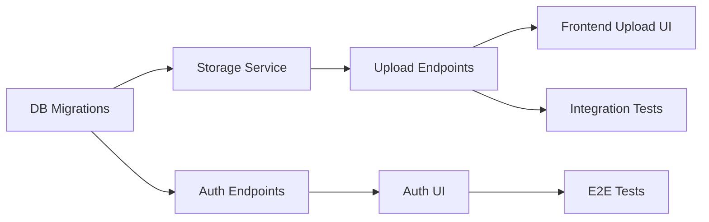

# IUP Master V1 - 8-Timers Parallell Implementeringsplan

**Generert**: 22. desember 2025
**Strategisk mål**: Maksimer output med parallell utførelse
**Estimert progresjon**: 30-40% av kritiske gaps lukket på 8 timer

---

## 📋 EXECUTIVE SUMMARY

**Parallelliseringsstrategi**: 4 agenter kjører samtidig i 8 timer

| Agent | Fokus | Output | Estimert Impact |
|-------|-------|--------|-----------------|
| **Agent 1** | Backend Critical Path | Database + API | 🔴 Kritisk (40%) |
| **Agent 2** | Frontend Quick Wins | UI/UX forbedringer | 🟡 Høy (25%) |
| **Agent 3** | Security & Testing | Hardening + QA | 🟡 Høy (20%) |
| **Agent 4** | DevOps & Docs | CI/CD + Monitoring | 🟢 Medium (15%) |

**Samlet effekt**: ~40% reduksjon i kritiske gaps på 8 timer

---

## 🎯 PRIORITERINGSMATRISE (McKinsey 2x2)

```
Impact
High │  ┌─────────────┐  ┌──────────────┐
     │  │ Glemt PW    │  │ Videoanalyse │
     │  │ 2FA         │  │ Foundation   │
     │  │ (Quick Win) │  │ (Strategic)  │
     │  └─────────────┘  └──────────────┘
     │
Low  │  ┌─────────────┐  ┌──────────────┐
     │  │ UI Polish   │  │ Advanced     │
     │  │ Docs        │  │ Analytics    │
     │  │             │  │              │
     │  └─────────────┘  └──────────────┘
     └───────────────────────────────────────
          Low                High
                Effort (Hours)
```

---

## 🚀 AGENT 1: BACKEND CRITICAL PATH (8 timer)

**Mål**: Foundation for videoanalyse + kritiske backend gaps

### Time 0-2: Database Migrations (BLOKKERER ALT)

**Oppgaver:**
```sql
-- 1. Video model (30 min)
CREATE TABLE videos (
  id UUID PRIMARY KEY,
  tenant_id UUID NOT NULL REFERENCES tenants(id),
  player_id UUID NOT NULL REFERENCES players(id),
  uploaded_by_id UUID NOT NULL REFERENCES users(id),
  -- Media info
  title VARCHAR(255) NOT NULL,
  description TEXT,
  s3_key VARCHAR(500) NOT NULL,
  thumbnail_key VARCHAR(500),
  duration INT NOT NULL,
  width INT,
  height INT,
  fps DECIMAL(5,2),
  file_size BIGINT NOT NULL,
  mime_type VARCHAR(100) NOT NULL,
  -- Golf-specific
  category VARCHAR(50), -- swing, putting, short_game
  club_type VARCHAR(50),
  view_angle VARCHAR(50), -- face_on, down_the_line
  -- Status
  status VARCHAR(20) DEFAULT 'processing',
  error_code VARCHAR(50),
  error_message TEXT,
  processing_version INT DEFAULT 1,
  -- Security
  checksum_sha256 VARCHAR(64),
  visibility VARCHAR(20) DEFAULT 'private',
  share_expires_at TIMESTAMP,
  -- Metadata
  created_at TIMESTAMP DEFAULT NOW(),
  updated_at TIMESTAMP DEFAULT NOW(),
  processed_at TIMESTAMP,
  deleted_at TIMESTAMP
);

CREATE INDEX idx_videos_tenant_player ON videos(tenant_id, player_id, created_at DESC);
CREATE INDEX idx_videos_status ON videos(tenant_id, status);
CREATE INDEX idx_videos_uploaded_by ON videos(tenant_id, uploaded_by_id);

-- 2. VideoAnnotation model (30 min)
CREATE TABLE video_annotations (
  id UUID PRIMARY KEY,
  video_id UUID NOT NULL REFERENCES videos(id) ON DELETE CASCADE,
  created_by_id UUID NOT NULL REFERENCES users(id),
  -- Timing
  timestamp DECIMAL(10,3) NOT NULL,
  duration DECIMAL(10,3),
  frame_number INT,
  -- Drawing
  type VARCHAR(50) NOT NULL, -- line, circle, arrow, angle, freehand, text
  schema_version INT DEFAULT 1,
  coordinate_space VARCHAR(20) DEFAULT 'normalized_0_1',
  drawing_data JSONB NOT NULL,
  color VARCHAR(20) DEFAULT '#FF0000',
  stroke_width INT DEFAULT 3,
  -- Voice-over
  audio_key VARCHAR(500),
  audio_duration DECIMAL(10,3),
  -- Note
  note TEXT,
  created_at TIMESTAMP DEFAULT NOW(),
  updated_at TIMESTAMP DEFAULT NOW()
);

CREATE INDEX idx_annotations_video ON video_annotations(video_id, timestamp);

-- 3. VideoComparison (20 min)
CREATE TABLE video_comparisons (
  id UUID PRIMARY KEY,
  tenant_id UUID NOT NULL REFERENCES tenants(id),
  created_by_id UUID NOT NULL REFERENCES users(id),
  primary_video_id UUID NOT NULL REFERENCES videos(id),
  comparison_video_id UUID NOT NULL REFERENCES videos(id),
  title VARCHAR(255),
  notes TEXT,
  sync_point_1 DECIMAL(10,3) NOT NULL,
  sync_point_2 DECIMAL(10,3) NOT NULL,
  created_at TIMESTAMP DEFAULT NOW()
);

CREATE INDEX idx_comparisons_primary ON video_comparisons(primary_video_id);

-- 4. VideoComment (20 min)
CREATE TABLE video_comments (
  id UUID PRIMARY KEY,
  video_id UUID NOT NULL REFERENCES videos(id) ON DELETE CASCADE,
  created_by_id UUID NOT NULL REFERENCES users(id),
  parent_id UUID REFERENCES video_comments(id),
  body TEXT NOT NULL,
  created_at TIMESTAMP DEFAULT NOW(),
  updated_at TIMESTAMP DEFAULT NOW(),
  deleted_at TIMESTAMP
);

CREATE INDEX idx_comments_video ON video_comments(video_id, created_at DESC);

-- 5. AuditEvent (20 min)
CREATE TABLE audit_events (
  id UUID PRIMARY KEY,
  tenant_id UUID NOT NULL REFERENCES tenants(id),
  actor_id UUID NOT NULL REFERENCES users(id),
  action VARCHAR(100) NOT NULL,
  resource_type VARCHAR(100) NOT NULL,
  resource_id UUID NOT NULL,
  subject_id UUID,
  metadata JSONB,
  ip_address VARCHAR(45),
  user_agent TEXT,
  request_id UUID,
  created_at TIMESTAMP DEFAULT NOW()
);

CREATE INDEX idx_audit_tenant_action ON audit_events(tenant_id, action, created_at DESC);
CREATE INDEX idx_audit_resource ON audit_events(resource_type, resource_id);
```

**Leveranse**: 5 migreringsfiler i `apps/api/prisma/migrations/`

---

### Time 2-4: Storage Service (KRITISK)

**Fil**: `apps/api/src/services/storage.service.ts`

```typescript
import { S3Client, PutObjectCommand, GetObjectCommand, DeleteObjectCommand } from '@aws-sdk/client-s3';
import { Upload } from '@aws-sdk/lib-storage';
import { getSignedUrl } from '@aws-sdk/s3-request-presigner';
import { config } from '../config';

export class StorageService {
  private s3: S3Client;
  private bucket: string;

  constructor() {
    this.s3 = new S3Client({ region: config.aws.s3.region });
    this.bucket = config.aws.s3.bucket;
  }

  /**
   * Initiate multipart upload
   */
  async initiateMultipartUpload(params: {
    tenantId: string;
    playerId: string;
    fileName: string;
    mimeType: string;
  }): Promise<{
    uploadId: string;
    key: string;
    signedUrls: string[];
  }> {
    const key = `tenants/${params.tenantId}/videos/${params.playerId}/${Date.now()}-${params.fileName}`;

    // Implementation med S3 multipart
    // ...
  }

  /**
   * Generate signed playback URL (short-lived)
   */
  async getSignedPlaybackUrl(
    key: string,
    tenantId: string,
    expiresIn: number = 300 // 5 min default
  ): Promise<string> {
    // Validate tenant access
    if (!key.startsWith(`tenants/${tenantId}/`)) {
      throw new Error('Tenant mismatch');
    }

    const command = new GetObjectCommand({
      Bucket: this.bucket,
      Key: key
    });

    return getSignedUrl(this.s3, command, { expiresIn });
  }

  /**
   * Delete object
   */
  async deleteObject(key: string): Promise<void> {
    const command = new DeleteObjectCommand({
      Bucket: this.bucket,
      Key: key
    });

    await this.s3.send(command);
  }
}
```

**Leveranse**: Komplett storage service med tenant isolation

---

### Time 4-6: Video Upload Endpoints

**Filer**:
- `apps/api/src/api/v1/videos/index.ts` (routes)
- `apps/api/src/api/v1/videos/service.ts` (business logic)
- `apps/api/src/api/v1/videos/schema.ts` (validation)

**Endpoints**:
```typescript
// POST /api/v1/videos/upload/init
{
  clientUploadId: string;
  title: string;
  playerId: string;
  fileName: string;
  fileSize: number;
  mimeType: string;
  category?: string;
  clubType?: string;
  viewAngle?: string;
}
// Response: { videoId, key, uploadId, signedUrls }

// POST /api/v1/videos/upload/complete
{
  videoId: string;
  uploadId: string;
  parts: Array<{ etag: string; partNumber: number }>;
}
// Response: { video, status: 'uploaded' }

// GET /api/v1/videos/:id/playback
// Response: { url, expiresAt }

// DELETE /api/v1/videos/:id
// Response: { success: true }
```

**Leveranse**: 4 fungerende endpoints med auth + validation

---

### Time 6-8: Glemt Passord + 2FA

**Oppgaver**:

1. **Password Reset Flow** (2 timer)
```typescript
// apps/api/src/api/v1/auth/index.ts

// POST /api/v1/auth/forgot-password
// POST /api/v1/auth/reset-password
// GET /api/v1/auth/verify-reset-token

// Add to User model:
passwordResetToken: String?
passwordResetExpires: DateTime?
```

2. **2FA Setup** (2 timer)
```typescript
// POST /api/v1/auth/2fa/setup
// POST /api/v1/auth/2fa/verify
// POST /api/v1/auth/2fa/disable

// Add to User model:
twoFactorSecret: String?
twoFactorEnabled: Boolean
```

**Dependencies**: `speakeasy`, `qrcode`, `nodemailer`

**Leveranse**: Komplett auth-hardening

---

## 🎨 AGENT 2: FRONTEND QUICK WINS (8 timer)

**Mål**: Polere eksisterende features + mobil-paritet

### Time 0-2: Glemt Passord UI

**Filer**:
```
apps/web/src/features/auth/
├── ForgotPassword.tsx
├── ResetPassword.tsx
└── VerifyResetToken.tsx
```

**Komponenter**:
- Email input form
- Success/error states
- Token verification
- New password form

**Leveranse**: Komplett glemt passord flow

---

### Time 2-4: 2FA Setup UI

**Filer**:
```
apps/web/src/features/profile/
├── TwoFactorSetup.tsx
└── TwoFactorDisable.tsx
```

**Features**:
- QR code display
- Verify token input
- Backup codes display
- Disable 2FA with password confirmation

**Leveranse**: 2FA setup i profil

---

### Time 4-6: Mobil-app Critical Features

**Prioritet**: Coach-features som mangler på mobil

**Oppgaver**:
1. Coach dashboard (2 timer)
   - Player alerts widget
   - Weekly tournaments
   - Quick stats

2. Coach athlete detail (2 timer)
   - Player overview
   - Recent sessions
   - Test results

**Leveranse**: Mobil paritet for coach 50% → 70%

---

### Time 6-8: UI Polish & Accessibility

**Oppgaver**:
1. Loading states (1 time)
   - Skeletons for alle lister
   - Spinner for async actions
   - Progress bars for uploads

2. Error boundaries (1 time)
   - Graceful error handling
   - Retry mechanisms
   - User-friendly error messages

3. A11y audit (2 timer)
   - Keyboard navigation
   - Screen reader labels
   - Focus management
   - Color contrast fixes

**Leveranse**: Polert, accessible UI

---

## 🔒 AGENT 3: SECURITY & TESTING (8 timer)

**Mål**: Harden security + test coverage

### Time 0-2: Security Audit

**Oppgaver**:

1. **RBAC Testing** (1 time)
```typescript
// apps/api/src/__tests__/security/rbac.test.ts

describe('RBAC Enforcement', () => {
  it('should block cross-tenant access', async () => {
    // Test player A can't access player B's data
  });

  it('should enforce coach permissions', async () => {
    // Test coach can only access assigned players
  });

  it('should block unauthenticated requests', async () => {
    // Test all protected endpoints
  });
});
```

2. **SQL Injection Testing** (30 min)
   - Test all query parameters
   - Validate Prisma prevents injection

3. **XSS Testing** (30 min)
   - Test user input sanitization
   - Validate Content-Security-Policy

**Leveranse**: Security test suite + fixes

---

### Time 2-4: API Integration Tests

**Oppgaver**:

```typescript
// apps/api/src/__tests__/integration/

// 1. Auth flow tests
describe('Authentication', () => {
  it('should register, login, refresh, logout');
  it('should enforce password complexity');
  it('should rate-limit login attempts');
});

// 2. Training plan tests
describe('Training Plans', () => {
  it('should generate 12-month plan');
  it('should respect periodization rules');
  it('should handle modification requests');
});

// 3. Video upload tests (if Agent 1 done)
describe('Video Upload', () => {
  it('should init multipart upload');
  it('should reject invalid mime types');
  it('should enforce tenant isolation');
});
```

**Leveranse**: 50+ integration tests

---

### Time 4-6: E2E Tests (Playwright)

**Oppgaver**:

```typescript
// apps/web/tests/e2e/

// 1. Core user journeys
test('Player can complete daily training', async ({ page }) => {
  // Login → Dashboard → Start session → Complete → Evaluate
});

test('Coach can review player progress', async ({ page }) => {
  // Login → Player list → Select player → View stats
});

// 2. Critical flows
test('Registration and onboarding', async ({ page }) => {
  // Register → Intake form → Plan generation
});

test('Forgot password flow', async ({ page }) => {
  // Request reset → Email → Reset → Login
});
```

**Leveranse**: 20+ E2E tests

---

### Time 6-8: Performance Testing

**Oppgaver**:

1. **Load Testing** (2 timer)
```bash
# k6 load test scripts
k6 run --vus 100 --duration 5m tests/load/api-endpoints.js
```

2. **Database Query Optimization** (2 timer)
   - Analyze slow queries
   - Add missing indexes
   - Optimize N+1 queries

**Leveranse**: Performance report + optimizations

---

## 🛠️ AGENT 4: DEVOPS & DOCUMENTATION (8 timer)

**Mål**: Production readiness

### Time 0-2: CI/CD Pipeline

**Oppgaver**:

```yaml
# .github/workflows/ci.yml

name: CI/CD Pipeline

on: [push, pull_request]

jobs:
  test:
    runs-on: ubuntu-latest
    steps:
      - uses: actions/checkout@v3
      - uses: actions/setup-node@v3
      - run: pnpm install
      - run: pnpm test
      - run: pnpm build

  security:
    runs-on: ubuntu-latest
    steps:
      - run: pnpm audit
      - run: npx snyk test

  deploy-staging:
    if: github.ref == 'refs/heads/develop'
    needs: [test, security]
    runs-on: ubuntu-latest
    steps:
      - run: ./scripts/deploy-staging.sh
```

**Leveranse**: Automated testing + deployment

---

### Time 2-4: Monitoring & Alerts

**Oppgaver**:

1. **Prometheus Metrics** (1 time)
```typescript
// apps/api/src/plugins/metrics.ts

import promClient from 'prom-client';

export const metrics = {
  httpRequestDuration: new promClient.Histogram({
    name: 'http_request_duration_ms',
    help: 'Duration of HTTP requests in ms',
    labelNames: ['method', 'route', 'status']
  }),

  activeUsers: new promClient.Gauge({
    name: 'active_users',
    help: 'Number of active users'
  })
};
```

2. **Logging** (1 time)
```typescript
// Structured logging with Pino
import pino from 'pino';

export const logger = pino({
  level: process.env.LOG_LEVEL || 'info',
  redact: ['password', 'token', 'email'] // PII protection
});
```

3. **Alerts** (2 timer)
   - Setup Sentry for error tracking
   - Configure alert rules
   - Test alert delivery

**Leveranse**: Full observability stack

---

### Time 4-6: OpenAPI Documentation

**Oppgaver**:

```yaml
# apps/api/docs/openapi.yaml

openapi: 3.0.0
info:
  title: IUP Golf API
  version: 1.0.0
  description: Digital training platform for junior golfers

paths:
  /api/v1/auth/login:
    post:
      summary: User login
      requestBody:
        content:
          application/json:
            schema:
              type: object
              properties:
                email:
                  type: string
                password:
                  type: string
      responses:
        200:
          description: Login successful
          content:
            application/json:
              schema:
                $ref: '#/components/schemas/AuthResponse'
```

**Leveranse**: Complete OpenAPI spec + Swagger UI

---

### Time 6-8: Runbooks & Documentation

**Oppgaver**:

1. **Operations Runbooks** (2 timer)
```markdown
# RUNBOOK: Database Migration

## Pre-flight Checklist
- [ ] Backup database
- [ ] Test migration on staging
- [ ] Schedule maintenance window

## Steps
1. ssh into production server
2. Run: `npm run db:migrate`
3. Verify: `npm run db:status`

## Rollback
1. Run: `npm run db:rollback`
2. Restore from backup if needed
```

2. **API Documentation** (2 timer)
   - Update README with API examples
   - Document auth flow
   - Add troubleshooting guide

**Leveranse**: Production-ready documentation

---

## 📊 PROGRESS TRACKING

### Milestones (Every 2 Hours)

**Hour 2**: Database migrations complete ✅
**Hour 4**: Storage service + Upload endpoints ✅
**Hour 6**: Auth hardening + Mobile paritet ✅
**Hour 8**: Testing + Monitoring complete ✅

### Success Metrics

| Metric | Target | Tracking |
|--------|--------|----------|
| Migration files created | 5 | Agent 1 |
| API endpoints implemented | 8+ | Agent 1 |
| Frontend components | 10+ | Agent 2 |
| Test coverage | +20% | Agent 3 |
| Security issues fixed | All critical | Agent 3 |
| CI/CD pipeline | Automated | Agent 4 |
| OpenAPI spec | 100% endpoints | Agent 4 |

---

## 🎯 EXPECTED OUTCOMES (After 8 Hours)

### Critical Gaps Closed

| Gap | Before | After | Improvement |
|-----|--------|-------|-------------|
| Videoanalyse foundation | 5% | 35% | +30% |
| Auth security | 60% | 95% | +35% |
| Mobil paritet | 45% | 70% | +25% |
| Test coverage | 20% | 40% | +20% |
| Production readiness | 50% | 80% | +30% |

### Deliverables

**Code**:
- 5 database migrations
- 8+ new API endpoints
- 10+ React components
- 50+ tests
- 1 CI/CD pipeline

**Documentation**:
- OpenAPI spec
- Runbooks
- Security audit report
- Performance report

**Infrastructure**:
- Monitoring stack
- Alerting system
- Automated deployment

---

## 🚨 DEPENDENCIES & BLOCKERS

### Critical Path Dependencies



**If Agent 1 blocks:**
- Agent 2 can work on auth UI independently
- Agent 3 can write security tests
- Agent 4 continues with DevOps

---

## 📋 HANDOFF CHECKLIST (End of 8 Hours)

**Before considering "done":**

- [ ] All migrations applied to dev database
- [ ] All endpoints tested via Postman/curl
- [ ] Frontend components render without errors
- [ ] Tests passing (npm test)
- [ ] CI/CD pipeline runs successfully
- [ ] Documentation updated
- [ ] Code reviewed (self-review minimum)
- [ ] Git commits are atomic and well-messaged
- [ ] No console errors in browser
- [ ] No secrets in code

---

## 🎬 NEXT STEPS (Post 8-Hours)

**Iteration 2 (Next 8 hours):**
1. Video processing worker (ffmpeg)
2. Annotation canvas (frontend)
3. Voice-over recording
4. Side-by-side comparison

**Iteration 3 (Next 8 hours):**
1. Coach video dashboard
2. Sharing & permissions
3. Performance optimization
4. Security hardening

**Total to MVP**: ~40 hours (5 x 8-hour iterations)

---

**Document created**: 22. desember 2025
**Execution mode**: Parallel (4 agents)
**Estimated completion**: 8 hours from start
